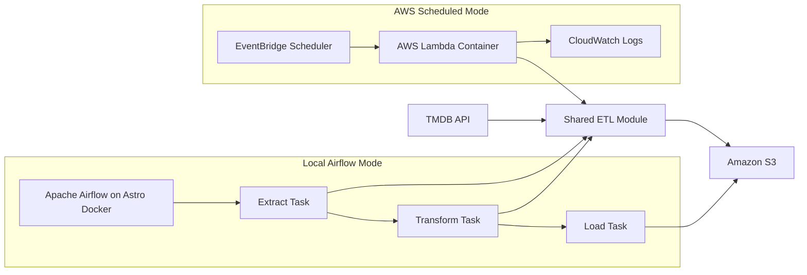

# Architecture

This project has two execution paths over the same shared ETL logic.

## Local Airflow Mode

Local mode is used for development, debugging, and showing the workflow as a DAG.

Flow:

```text
Astro/Docker -> Airflow DAG -> Extract -> Transform -> Load -> S3
```

Airflow uses:

- `dags/movies_etl.py`
- Airflow Variables
- `aws_default` Airflow connection
- `S3Hook` for uploading parquet to S3

## AWS Scheduled Mode

AWS mode is used for weekly cloud execution.

Flow:

```text
EventBridge Scheduler -> Lambda -> Shared ETL Module -> S3
```

Lambda uses:

- `lambda_handler.py`
- `src/tmdb_pipeline.py`
- environment variables
- IAM role permissions
- `boto3` for uploading parquet to S3

## Shared ETL Module

The reusable ETL code lives in:

```text
src/tmdb_pipeline.py
```

It handles:

- fetching weekly trending movies from TMDB
- fetching detail metadata for each movie
- building enriched records
- converting records to parquet
- generating partitioned S3 keys
- uploading parquet bytes to S3 in Lambda mode

## Mermaid Diagram


